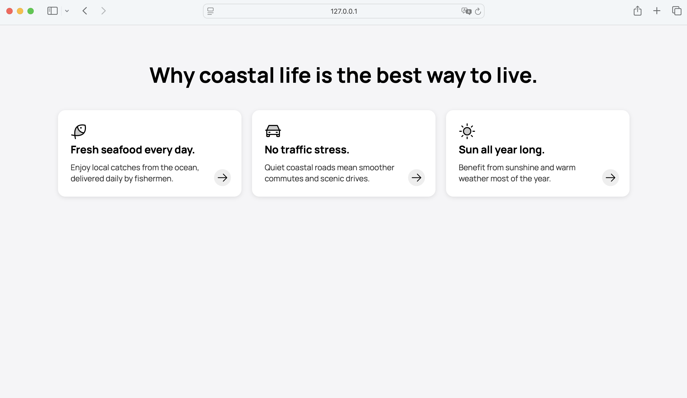

# CSS Arena – Aufgabe 2: Küstenleben

## Thema: Warum das Küstenleben großartig ist 🐟 🚗 ☀️

Erstelle eine CSS-Datei `styles.css`, die die Gestaltung der folgenden Boxen exakt dem unten abgebildeten Design nachempfindet.

> 🧱 Die HTML-Struktur ist bereits vorgegeben in `index.html` und **darf nicht verändert werden**.

### Designvorgabe:

### Anforderungen:

- Drei nebeneinanderliegende Boxen im Kartenstil
- Gleiche Höhe, gleichmäßige Abstände
- Weiche, abgerundete Ecken und dezente Schatten
- Jedes Feature enthält:
  - ein Icon oben links
  - eine große, fette Überschrift
  - einen kurzen erklärenden Text darunter
  - ein Symbol-Button unten rechts (➡️)
- Schriftart: Manrope
- Hintergrundfarbe der Seite: hellgrau (`#f5f5f`7`)
- Ein Hover-Effekt für die Card (siehe Designvorgabe) 

---

💡 **Tipp:** Nutze `flexbox`, `gap`, `border-radius`, `box-shadow` für feine Details.

Viel Spaß beim Coden! 🚀
